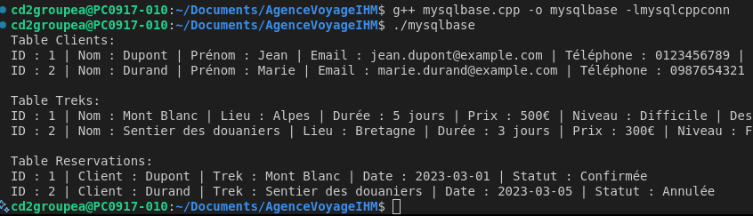

TODO: changer les "je", "on" , "nous" par un verbe conjugée:
   ex : Nous créons le .env > Création du .env.
# Documentation

## Énoncé

Développer une application en C++ pour une agence de voyage spécialisée dans l'organisation de treks. Le programme devra gérer les clients, les treks disponibles, les réservations, et intégrer une API météo pour fournir des informations sur les conditions climatiques des destinations. Une interface graphique permettra aux utilisateurs de gérer et de consulter les données facilement.

---

## Pré-requis

1. Installer les bibliothèques nécessaires (**libs**) :
   - (Liste des bibliothèques à ajouter ici)

## Lancer l'application

## Structure du projet

## Conception

### Analyse des besoins :
Nous utilisons **Draw.io** pour créer les diagrammes suivants :

TODO: corriger les diagrammes
ex: use case ajouter api meteo
ex: verifier cardinalités et include exclude
ex: ...

- **Diagramme des cas d'utilisation** : Représente les interactions principales.

- **Diagramme de classe** : Modélise les relations entre les entités.

### Conception de la base de donnée :
    Clients : (id, nom, prénom, email, numéro de téléphone, date d'inscription).
    Treks : (id, nom, lieu, durée (jours), prix, niveau de difficulté, description).
    Réservations : (id, client_id, trek_id, date de réservation, statut).
---

## Développement

On choisit d'utiliser un orchestrateur pour notre base de donnée comme Docker.
On utilise une bibliothèque comme MySQL Connector/C++ pour interagir avec la base de données.
On utilise wxWidgets pour L'interface Utilisateur

### Base de donnée
   On crée notre .env
   On crée notre orchestrateur docker-compose.yml 
      $ docker compose up --build -d
      On se connecte avec un outil externe :
         mysql -h 127.0.0.1 -P 3310 -u cppuser -p
            show databases;
            use agencesqslctn
      Maintenant nos identifiants sont dans le cache du container docker on peut se connecter via un terminal bash ou executer notre fichier  mysqlbase.cpp qui va automatiquement se connecter et charger/créer les tables.
   On crée notre fichier qui servira a load la base mysqlbase.cpp
      Dans ce fichier nous créons la connexion a la base de donnée, créons les tables si elles n'existent pas et insérons des données fictives "fixtures". on finit par montrer le resultat de l'insertion dans le terminal.
      On execute la commande suivnte :  g++ mysqlbase.cpp -o mysqlbase -lmysqlcppconn
      Puis ./mysqlbase
      On a un résultat : 
   On refactor notre fichier mysqlbase.cpp en db_setup.cpp et db_setup.h avec une Fonction void DatabaseInitializer::initializeDatabase() 

### CMake et wxWidgets

   On installe CMake et wxWidgets
   On ajoute un CMakeLists.txt
   On crée un dossier build
   On ajoute le json.hpp de la librairie nlohmann/json: JSON for Modern C++ a notre main.cpp

   On ouvre un terminal et on execute :
   - cmake ..
   - make
   - ./wxApp
   - Notre simple fenetre s'ouvre.
  
  On se rend compte que notre script pour la creation de la base de donnée utilise un int main() ce qui leve une erreur lors de la compilation avec CMake.
  On corrige cette erreur, on compile et ça fonctionne, on peut maintenant lister les clients depuis notre application

---
Database Initialization:

    Tables are created or updated automatically when the application is run.
    This ensures a seamless setup process for your application.

Application Functionality:

    The main window opens correctly.
    The "List Clients" feature works, pulling data from the database and displaying it.
    The "Add Clients" button is functional with placeholder behavior.