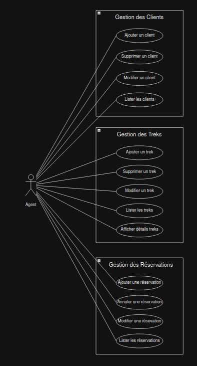
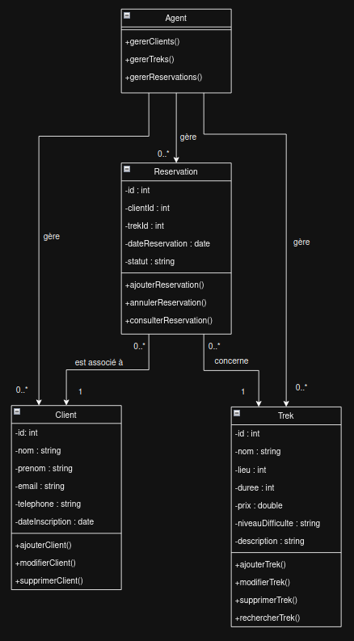

# AgenceVoyageCpp

Un projet C++ pour une application d'agence de voyage.

## Table des matières

1. [À propos](#à-propos)
2. [Pré-requis](#pré-requis)
3. [Installation](#installation)
4. [Configuration](#configuration)
5. [Conception](#conception)
6. [Développement](#développement)
7. [Utilisation](#utilisation)
8. [Contribuer](#contribuer)
9. [Licence](#licence)

---

## À propos

**AgenceVoyageCpp** est une application écrite en C++ pour la gestion d'une agence de voyage. Elle s'appuie sur plusieurs bibliothèques externes, notamment pour gérer les bases de données, les interfaces utilisateur, et les requêtes HTTP.

---

## Pré-requis

Avant de commencer, assurez-vous que les outils et bibliothèques suivants sont installés sur votre système :

### Outils requis

- [Clang](https://clang.llvm.org/) : Compilateur pour C++.
- [CMake](https://cmake.org/) : Générateur de build.
- [Docker](https://www.docker.com/) : Pour gérer les conteneurs MySQL.
- [Visual Studio Code](https://code.visualstudio.com/) (ou tout autre IDE).

### Bibliothèques nécessaires

- Connecteur MySQL pour C++ : `libmysqlcppconn-dev`
- Bibliothèque Curl : `libcurl4-openssl-dev`
- wxWidgets pour les interfaces graphiques : `libwxgtk3.2-dev`

---

## Installation

### 1. Installer les outils et bibliothèques

Exécutez les commandes suivantes pour installer les outils et bibliothèques nécessaires :

```bash
sudo apt update
sudo apt install clang cmake libmysqlcppconn-dev libcurl4-openssl-dev
sudo add-apt-repository ppa:hrzhu/wxwidgets3.2-backport
sudo apt update
sudo apt install libwxgtk3.2-dev
```

### 2. Installer Docker et Docker Compose

Assurez-vous que Docker et Docker Compose sont installés. Vous pouvez les installer via la commande suivante :

```bash
sudo apt install docker.io docker-compose
```

### 3. Configurer votre IDE (exemple avec Visual Studio Code)

Installez les extensions suivantes pour un support complet du développement en C++ :
- **C/C++ by Microsoft**
- **CMake Tools by Microsoft**
- **C/C++ Extension Pack**
- **Better C++ Syntax**
- **MakeFile Tools**

---

## Configuration

### 1. Lancer le conteneur MySQL

Utilisez Docker Compose pour démarrer la base de données MySQL :

```bash
docker compose up --build -d
```

Vérifiez que le conteneur est opérationnel avec :

```bash
docker ps
```

### 2. Configurer la connexion MySQL dans l'application

Modifiez les paramètres de connexion à la base de données dans votre application, si nécessaire :
- Hôte : `localhost`
- Port : `3310`
- Utilisateur et mot de passe : définis dans le fichier `docker-compose.yml` et `.env`

---

## Conception

La conception du projet :

1. **Diagramme des cas d'utilisation** :
   - 

2. **Diagramme de classe** :
   - 

---

## Développement

### Outils et Langages
- **Langage principal** : C++.
- **Frameworks et Bibliothèques** :
  - wxWidgets : Pour la création d'une interface graphique.
  - MySQL Connector : Pour interagir avec la base de données.
  - Curl : Pour gérer les requêtes HTTP.

### Structure du Projet
1. **Fichiers principaux** :
   - `main.cpp` : Point d'entrée de l'application.
   - `CMakeLists.txt` : Configuration du build avec CMake.

2. **Organisation** :
   - `build/` : Répertoire de génération.
   - `Documents/` : Répertoire de Documents 
   - `src/` : Code source de l'application.

3. **CMake** :
   - Le fichier `CMakeLists.txt` gère les dépendances et les paramètres de compilation.

---

## Utilisation

### 1. Compiler l'application

Exécutez les commandes suivantes pour compiler et lancer l'application :

```bash
mkdir build
cd build
cmake ..
make
./nom_de_votre_application
```

### 2. Vérifier la connexion à la base de données

Assurez-vous que l'application peut se connecter au conteneur MySQL.

---

## Contribuer

Les contributions sont les bienvenues ! Veuillez suivre les étapes suivantes :
1. Forkez ce dépôt.
2. Créez une branche pour vos modifications : `git checkout -b ma-branche`.
3. Committez vos modifications : `git commit -m "Description des modifications"`.
4. Poussez sur la branche : `git push origin ma-branche`.
5. Créez une Pull Request.

---

## Licence

Ce projet est sous licence [MIT](LICENSE). Consultez le fichier `LICENSE` pour plus d'informations.